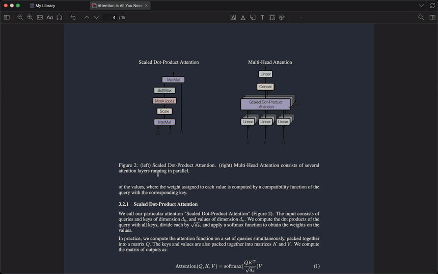
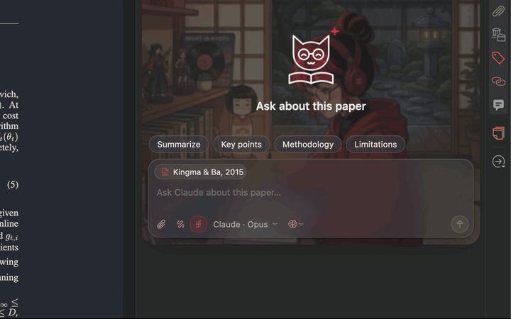
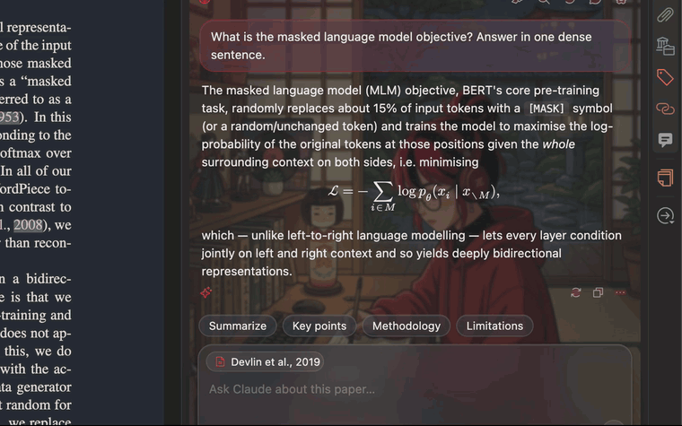
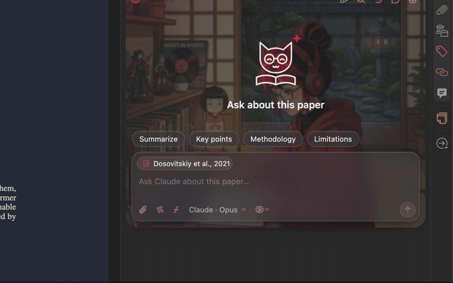

<p align="center"></p>

<h1 align="center">AbstractIn</h1>

<p align="center"><b>Your study buddy inside Zotero.</b><br>Ask about the paper you're reading. Get maths, drawings and proofs back.</p>

<p align="center">
  <a href="https://github.com/shen-zhang-42/abstractin/actions/workflows/ci.yml"></a>
  <a href="https://github.com/shen-zhang-42/abstractin/releases/latest"></a>
  
  
  
  <a href="LICENSE"></a>
</p>

<p align="center"></p>

**Current AbstractIn milestone**

AbstractIn is an independently maintained Zotero reading assistant developed from **[Zusia](https://github.com/firekern/zusia), originally created by [Andrea Porcelli (firekern)](https://github.com/firekern)**. The original project provides the foundation for the Zotero integration, assistant backends and conversation rendering. AbstractIn extends that work with book-reading workflows, chapter discussions, source lookup, conversation management and reading companions.

Zusia is released under the [MIT License](https://github.com/firekern/zusia/blob/main/LICENSE), which permits modification, publication and redistribution provided its copyright notice and permission text are retained. AbstractIn preserves Andrea Porcelli's original copyright and the complete MIT license in [LICENSE](LICENSE), including in every packaged `abstractin.xpi`. Bundled third-party notices are retained in [THIRD_PARTY_NOTICES.md](THIRD_PARTY_NOTICES.md).

Version 0.2.33 supports **Start Reading → companion-led questions in the chat → confirm the title, material type, exact PDF and reading goal → rendered answers → editable Zotero child notes**. Answers follow the shared plugin language setting. Codex remains the default; checked custom agents can be selected in Settings → Assistants.

The original `book-reading`, `scientific-paper-reading` and the paper skill's local extraction dependency are bundled without modification. Local skills may be used from your `.codex/skills` directory; `scientific-book-reading` is recognized as the folder alias for `book-reading`.

See [Windows installation and verification](docs/WINDOWS-TESTING.md). No running Codespace is needed. Source development uses this checkout's `src/` directory; run `npm run source:path` to print its absolute location.

In PDF readers, use the gray document-and-chat icon in the top toolbar beside the **Toggle Context Pane** controls to open the dedicated AbstractIn panel. The chat has its own right-side panel with a fixed composer and scrollable messages. It uses a plain gray theme, a companion welcome with a clickable “let's start reading” button, the header tools and the complete composer controls. For a new document, the composer stays hidden and Chats and new discussion stay disabled until Start Reading initialization succeeds. Title and goal can be entered directly in the inline setup cards. First-install setup appears inside this dedicated reading panel, never in the original context-pane section. It guides checked agent/model selection, companion, accent, font and text size, language, and chat interaction preferences. Confirmed documents restore their reading chat on subsequent visits, including after restarting Zotero. HTML elements and Zotero resource loading keep these controls usable in native reader windows. Close/reopen preserves drafts and running requests; switching PDF tabs selects the matching chat. The library item section remains available. In readers, the item section also keeps an **Open AbstractIn panel** launcher, so a missed toolbar event cannot hide every entry. Already-open PDFs receive a toolbar entry when the plugin starts; its visible AbstractIn label remains usable if the icon fails to load.

Books initialize their actual table of contents from a bounded source excerpt without generating chapter summaries or scanning every chapter for page links. Failed automatic initialization is not repeated on subsequent visits. Completed discussions remain editable Zotero notes; verified source links preserve the original reading position. The old Contents & records, Return to reading and Resume here controls are temporarily removed while a new records entry point is designed. Unverified source page locations do not prevent a discussion note from saving; guessed links are omitted and source gaps are reported separately.

Current-page discussions receive text directly from the open reader at the page captured when you send the question, independently of the whole-document index. Page text is cached per loaded PDF; verified quotations can produce physical-page links even when global mapping is unavailable. Blank edge pages are restored only after comparing native reader pages with extracted text. Chapter navigation resolves locations on demand from a unique PDF bookmark, verified page label or mapped heading. It never assumes a fixed printed-page offset; the workspace UI currently has no dedicated entry button.

AbstractIn uses a simple gray document with a conversation bubble as its app icon. Settings → Appearance → Reading companion offers a gray-brown marmoset, a black-and-white white wagtail, and a puffin with an orange beak. The marmoset gently sways its ringed tail; the wagtail bobs its long tail up and down; the puffin gently lifts and lowers its wing. Their bodies stay still, and reduced-motion preferences disable companion animation. The selected companion welcomes first-time readers, then appears at the left of the shortcut row immediately above the composer, followed by “Ask me a question?” and a compact question dropdown. Selecting a question fills the composer so it can be edited before sending. Custom instructions are also stored as editable quick prompts, with no automatic injection. Behaviour retains only send-key, automatic-scrolling, activity-display and quick-prompt visibility preferences; explanation detail follows the question instead of fixed length, level or tone settings. Book and paper prompt lists are edited independently in Settings → Chat. Material type, language, agent and PDF status appear below the composer. Changes apply to open panels and are saved for the next session. The Codex model menu reads the local CLI catalog through `codex app-server` and `model/list`, supports refresh and manual model IDs, and uses the same sign-in as `codex exec`. Model-specific reasoning choices follow the catalog. Catalog entries are not proof of account entitlement; a completed inference verifies access. All button SVGs are bundled with the startup script, so reader frames do not depend on separate resource reads to display their icons.

Drawing and LaTeX answer modes are removed: the agent chooses prose, mathematical notation and formal environments to suit the material and question, respecting explicit requests. Drawings are requested in the question itself. Rendering still uses KaTeX and sanitized SVG; these are formatting instructions and rendering code, not separate skills.

The icon dropdown inside the composer’s bottom toolbar uses dedicated Lucide brain-circuit and file-search symbols and offers **Knowledge discussion** and **Source verification**. Knowledge discussion reuses saved notes, conversation and cached page text, skipping full-text extraction and disabling Codex command execution, apps and web search for ordinary follow-ups. An explicit current-page question reads only that page. When available context supports an answer without guessing, the assistant answers directly. Missing document-specific evidence triggers one automatic source-verification pass, and an explicit request to inspect the original source verifies it immediately. Numbered references include appendix labels such as Theorem A.78; mentioning a number alone does not force another lookup. Verification uses cached source text first and must report an unfound passage instead of guessing. An explicit prohibition on reading/searching the document prevents both new page reads and automatic verification for that turn. The selected mode persists; initial contents and explicit paper-summary actions always verify their sources. New chat preserves document-level contents, summaries and notes and starts a new backend session. Chats restores each discussion with its own available session. Replies and workspace recaps use bundled KaTeX, including multiline formulas and bare array environments. Copying selected reply text keeps formulas as TeX; the answer-copy action preserves Markdown and LaTeX. An undefined `\ThetaSpace` is displayed as its literal symbol name, without inferring its definition.

The local workspace contains a PDF copy and text extracted by Zotero, with physical page boundaries when verified. Codex reads relevant portions as needed; the full text is not inserted into every prompt. Missing files and image-only PDFs produce explicit errors; OCR and QMD/HTML report export are not included. The demos below show the inherited AbstractIn interface.

**Inherited interface**

- 💬 A chat **next to the PDF**, in Zotero's side pane.
- ✏️ Answers with **LaTeX**, **drawings** and numbered **theorem boxes**.
- 🔑 Uses **Claude Code, Codex or Antigravity** with your own login. No API keys.
- ⏱️ Install in 2 minutes: [jump to Install](#install).

<p align="center"></p>

## 1. Ask about the paper

> **Open the side pane → AbstractIn → ask.** Turn on *Drawing* and *LaTeX* for a diagram and real maths.
>
> Real recording: Zotero on a Mac, *Attention Is All You Need*, a live answer from Claude. 27 seconds, with the wait sped up.

<p align="center"></p>

<p align="center"><a href="docs/videos/abstractin-chat.mp4">▶ Watch in full quality (MP4)</a></p>

## 2. Make it yours

Settings → Assistants supports custom ACP v1 agents and imported JSONL adapter configurations. Test skill compatibility before selecting a new reading agent. Original skills stay unchanged; verified adaptation instructions are cached separately. See [agent configuration and adapter contracts](docs/agent-adapters.md).

> **Settings → AbstractIn.** Choose the reading companion, accent colour, button labels, spacing, font and text size. Accent colour controls send buttons, formal headings and rules, links and drawings in both the sidebar and reading panel. The interface uses plain surfaces with fixed corners; older background, glass, glow and pattern preferences are ignored. Answer length, level and tone remain in Behaviour.

<p align="center"></p>

<p align="center"><sub>Eight accents. Red on black is the one in every video here.</sub></p>

## 3. Follow a proof

> **Turn on *LaTeX*.** Definitions, lemmas and theorems come back as numbered boxes, and every `\ref` is a link: click to jump, **Back** (⌥←) to return.

<p align="center"></p>

<p align="center"><a href="docs/videos/abstractin-proof.mp4">▶ Watch in full quality (MP4)</a></p>

## 4. Didn't click? Ask again, better

> **One button under every answer.** It comes back with the intuition first, then the steps, an example and the usual trap.

<p align="center"></p>

<p align="center"><a href="docs/videos/abstractin-explain-better.mp4">▶ Watch in full quality (MP4)</a></p>

## 5. Ask about a figure

> **📎 → *Current PDF page*.** The page you are looking at goes with the question, so figures and tables can be asked about. Upload, paste, drop or screenshot work too.

<p align="center"></p>

<p align="center"><a href="docs/videos/abstractin-figure.mp4">▶ Watch in full quality (MP4)</a></p>

<p align="center"></p>

## Everything else, in one line each

| | Feature | How |
|:--:|---|---|
| 🔴 | **Explain a passage** | Select text in the PDF → *Explain this* |
| 🟠 | **Ask about a passage** | Select text → *Ask your assistant about this*, then add your question |
| 💬 | **Chats** | Browse chapters and discussions, manage chats, select a turn, or search messages and jump to a match |
| 🟣 | **Notes** | Save any answer or drawing as a Zotero note under the paper |
| 🟢 | **Models** | Pick assistant, model and reasoning effort from the message box |
| ⚫ | **Setup** | A visual wizard on first run |

## Install

1. **Install local Codex CLI** and sign in. Start Reading uses Codex; see the [Windows instructions](docs/WINDOWS-TESTING.md).
2. **Download `abstractin.xpi`** from the [latest release](https://github.com/shen-zhang-42/abstractin/releases/latest).
3. **In Zotero:** Tools → Plugins → ⚙ → *Install Plugin From File…* → pick the `.xpi`. Restart if asked.
4. **Open a book or paper PDF.** Click the AbstractIn book icon in the reader toolbar to open its dedicated panel, then click **Start Reading**, confirm the attachment and material type, then initialize the book contents or choose a paper summary or immediate questions.

The plugin update feed points at this AbstractIn repository. Releases include `abstractin.xpi` and `updates.json`, which Zotero uses for in-place updates. Previously installed AbstractIn builds with plugin ID `abstractin@shen-zhang-42.github.io` and this repository's update URL can upgrade to a higher released version, including from 0.2.32 to 0.2.33. Use Zotero's plugin manager to check for updates, or let Zotero check automatically when plugin auto-updates are enabled. A locally installed 0.2.33 build will not receive another 0.2.33 update; it can update when a higher version is released. Original Zusia installations use a different plugin ID and update feed, so install AbstractIn manually once to receive AbstractIn updates.

## Sync across computers

Saved discussion notes, contents, summaries, the last recorded reading position and complete conversation text are Zotero child notes attached to the exact item/PDF identity. Zotero data sync carries them independently of PDF file downloads. Install AbstractIn on another computer, sync the same library and use Start Reading for that PDF: a fresh local workspace reconstructs chapter groups and complete discussion transcripts from sync notes. Each discussion keeps its own local agent session; returning to a chapter resumes that session when available. **Chats** groups chapters and discussions, with turn previews and a search field for the current document or all documents. Its **Migrate legacy discussions** button imports older current/archived chats without deleting originals or guessing chapter ownership. The new discussion button sits in the toolbar below the message input, beside Send, and creates another independent thread in the current chapter. See [Chapter discussions](docs/CHAPTER-DISCUSSIONS.md) for routing, source boundaries, migration and long-paper behavior.

Long transcripts are stored in text chunks without truncation. Partial sync never restores an incomplete transcript. When another computer continues an imported chat it writes a separate branch, preserving the source computer's notes. Note-save failures preserve local conversation text and show a sync warning.

Choose **Download files: As needed** in Zotero's file-sync settings to download only PDFs you open. All notes/metadata in the enabled library still data-sync; Zotero does not limit note sync to just the downloaded PDF. PDF availability depends on file syncing or the attachment's local availability. Recorded position does not represent completion or mastery.

Plugin settings, Codex session identifiers, screenshots/image files and extracted PDF caches remain local. The synced history contains message text, LaTeX and message metadata; an image-only question needs its image supplied again on another computer. The local `reading.json` activation/type setting is not synced. Syncing notes does not automatically activate Start Reading on a new computer.

## Privacy

- 🖥️ The assistants run **on your computer** with your own login. No server, no API keys.
- 📄 Codex receives document metadata, annotations, the selected passage, the explicitly named reading skill, derived copies of saved reading notes, and any page image you attach. The reading workspace includes a local PDF copy and extracted text that Codex can inspect. Document content read by Codex is sent to the model through your signed-in account.
- 📁 PDF/text copies, chat caches and images stay in `abstractin/` inside Zotero's data folder. Reading records and full chat text are saved as Zotero child notes and are uploaded through Zotero data sync when enabled. Screenshots, PDF/text caches, plugin settings and backend session identifiers stay local. Two-computer synchronization still needs actual Zotero verification.

<p align="center"></p>

<details>
<summary><b>For developers: build, test, release, record the videos</b></summary>

## Build

```sh
npm ci
npm run build        # writes abstractin.xpi
```

## Test

```sh
npm test             # unit tests (jsdom): rendering, settings, wizard, backends, repo checks
npm run shots        # screenshots of the UI in headless Firefox (optional)
npm run test:zotero  # headless Zotero integration run (Linux, Flatpak)
ZOTERO_BIN=/path/to/zotero bash test/integration/appearance.sh # native layout and icons
ZOTERO_BIN=/path/to/zotero bash test/integration/restart.sh    # install built XPI and restart twice
ABSTRACTIN_BACKGROUND=path/to/illustration.jpg npm run videos   # re-records the README videos (macOS)
```

The videos are recorded in a real Zotero with its own demo profile and library, so your library is never used. The scenes move the real pointer: don't touch the Mac while they run. Needs `ffmpeg`, `cliclick`, the `claude` CLI, and Screen Recording and Accessibility permission for the terminal.

## Release

After choosing to publish a release, keep `version` consistent in `package.json`, the root entries in `package-lock.json`, and `src/manifest.json`, then tag the tested commit:

```sh
git tag v0.2.33
git push origin v0.2.33
```

The tag is what releases. `.github/workflows/release.yml` refuses to run if the tag and the two versions disagree, then runs the tests, builds the `.xpi`, writes `updates.json` and attaches both to a GitHub release. Pushing to `main` never publishes anything. Zotero can offer an automatic update only after the release and its `updates.json` asset are publicly available, and the released version must be higher than the installed version. All packages use the single filename `abstractin.xpi`.

New behaviour starts with a failing test; see [CONTRIBUTING.md](CONTRIBUTING.md).

</details>

## Credits

Icons: [Phosphor Icons](https://phosphoricons.com) (MIT). Maths: [KaTeX](https://katex.org) (MIT) and Latin Modern Math (GUST Font License). The study buddies are original to this project; the illustrations were made for Zusia with Google Gemini. Papers in the videos: arXiv 1706.03762, 1512.03385, 1810.04805, 2010.11929, 2005.14165, 1412.6980. Details in [THIRD_PARTY_NOTICES.md](THIRD_PARTY_NOTICES.md).

Original project: [Zusia](https://github.com/firekern/zusia) by [Andrea Porcelli (firekern)](https://github.com/firekern). AbstractIn builds on that work and preserves its MIT license and original copyright. See [LICENSE](LICENSE).
